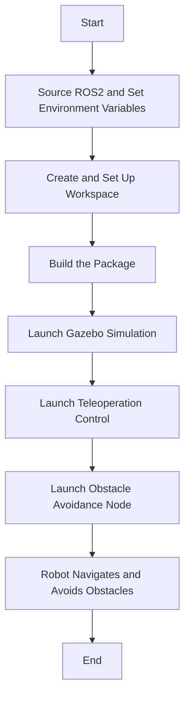

# TurtleBot3 Obstacle Avoidance with ROS2 Humble

This repository provides the procedure to execute an obstacle avoidance algorithm using ROS2 Humble with a TurtleBot3. The robot navigates in a Gazebo simulation environment, utilizing LIDAR sensor data to detect and avoid obstacles. The algorithm determines whether the robot should move forward or rotate to circumvent obstacles. Additionally, it can be extended to include start and goal nodes, enabling path following while avoiding obstacles.

## Authors:

Mohammed Husamuddin - 2021A7PS0123U
Mohammed Zubair - 2021A7PS0211U
Khushii Wason - 2021A7PS0123U
Drashti Parmar - 2021A7PS0173U
Kritika Rathi - 2022A4PS0300U
Mithil Dudam - 2021A7PS0142U
Larissa Alexander - 2021A7PS0206U

## Setup and Execution

### Prerequisites

- **ROS2 Humble**: Ensure ROS2 Humble is installed on your system.
- **TurtleBot3 Packages**: Install the necessary TurtleBot3 packages.
- **Gazebo Simulator**: Install Gazebo for simulation purposes.

### Installation Steps

1. **Source ROS2 and Set Environment Variables**:

   ```bash
   source /opt/ros/humble/setup.bash
   export TURTLEBOT3_MODEL=waffle_pi
   ```

2. **Create and Set Up Workspace**:

   ```bash
   mkdir -p ~/ros2_ws/src
   cd ~/ros2_ws/src
   git clone https://github.com/vinay06vinay/Turtlebot3-Obstacle-Avoidance-ROS2.git
   cd ..
   ```

3. **Build the Package**:

   ```bash
   colcon build --packages-select obstacle_avoidance_tb3
   source install/setup.bash
   ```

### Running the Simulation

1. **Launch Gazebo Simulation**:

   ```bash
   ros2 launch turtlebot3_gazebo turtlebot3_dqn_stage2.launch.py
   ```

2. **Launch Teleoperation Control** (in a new terminal after Gazebo launches):

   ```bash
   source /opt/ros/humble/setup.bash
   source ~/ros2_ws/install/setup.bash
   export TURTLEBOT3_MODEL=waffle_pi
   ros2 run obstacle_avoidance_tb3 turtlebot_teleop.py
   ```

   **Keyboard Controls**:

   - `w` : Move forward
   - `x` : Move backward
   - `a` : Rotate left
   - `d` : Rotate right
   - `s` or `space` : Stop
   - `CTRL-C` : Quit

3. **Launch Obstacle Avoidance Node** (in another terminal):

   ```bash
   source /opt/ros/humble/setup.bash
   source ~/ros2_ws/install/setup.bash
   ros2 launch obstacle_avoidance_tb3 launch.py
   ```

## Project Workflow



## Results

Demonstration videos are available in the `results` folder of the cloned directory.

<p align="center">
  
</p>

## References

1. [TurtleBot3 Simulation in Gazebo](https://emanual.robotis.com/docs/en/platform/turtlebot3/simulation/)
2. [Python3 Rocker](https://github.com/osrf/rocker)
3. [TurtleBot3 Teleop](https://github.com/ROBOTIS-GIT/turtlebot3/tree/humble-devel/turtlebot3_teleop)
