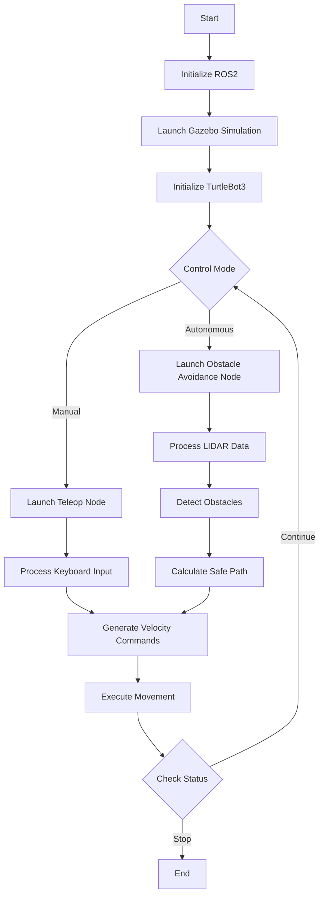
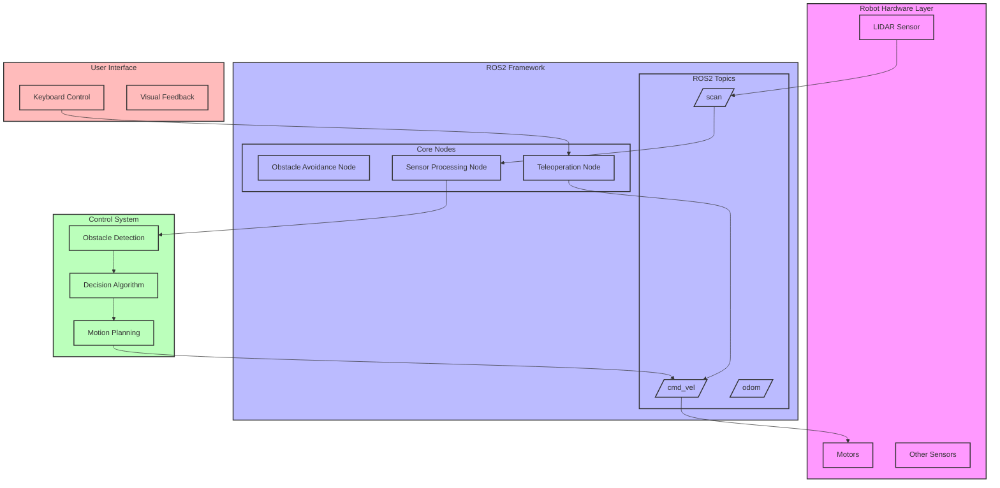

# Autonomous Navigation and Obstacle Avoidance using TurtleBot3 in ROS2
### BITS Pilani, Dubai Campus

## Authors
- Mohammed Husamuddin (2021A7PS0123U)
- Mohammed Zubair (2021A7PS0211U)
- Khushii Wason (2021A7PS0123U)
- Drashti Parmar (2021A7PS0173U)
- Kritika Rathi (2022A4PS0300U)
- Mithil Dudam (2021A7PS0142U)
- Larissa Alexander (2021A7PS0206U)

## Table of Contents
1. [Introduction](#introduction)
2. [Implementation](#implementation)
   - [Environment Setup](#environment-setup)
   - [Package Structure](#package-structure)
   - [Obstacle Avoidance System](#obstacle-avoidance-system)
   - [Simulation Testing](#simulation-testing)
3. [Results](#results)
4. [Conclusion](#conclusion)
   - [Summary](#summary)
   - [Future Scope](#future-scope)
5. [References](#references)

## Introduction
This project implements an autonomous obstacle avoidance system using TurtleBot3 and ROS2 Humble. The primary objective is to create a robust navigation system that can autonomously detect and avoid obstacles in real-time. The project leverages LIDAR sensor data for environmental perception and implements intelligent decision-making algorithms for navigation.

## Implementation

### Environment Setup
- **Operating System**: Ubuntu 22.04 LTS
- **ROS Distribution**: ROS2 Humble
- **Simulation Platform**: Gazebo
- **Robot Platform**: TurtleBot3 (Waffle Pi model)
- **Programming Language**: Python3
- **Additional Tools**: 
  - TurtleBot3 Packages
  - Gazebo ROS Packages
  - Navigation and Control Libraries

### Package Structure
The project is organized into several key components:

1. **Core Navigation Node** (`obstacle_avoidance.py`):
   - Processes LIDAR sensor data
   - Implements obstacle detection algorithms
   - Controls robot movement and navigation

2. **Teleoperation Control** (`turtlebot_teleop.py`):
   - Provides manual control interface
   - Implements keyboard-based navigation
   - Enables testing and validation

3. **Launch Configuration** (`launch.py`):
   - Configures simulation environment
   - Initializes required ROS2 nodes
   - Sets up parameter values

## Execution Flow

### Obstacle Avoidance System

#### Sensing Mechanism
- Uses LIDAR sensor for 360-degree environmental scanning
- Processes point cloud data to detect obstacles
- Creates real-time environmental mapping

#### Decision Making
The system implements a decision-making algorithm that:
1. Analyzes LIDAR data to detect obstacles
2. Determines safe navigation paths
3. Controls robot movement based on:
   - Distance to obstacles
   - Available free space
   - Current movement direction

#### Control System
- **Forward Movement**: When path is clear
- **Rotation**: To avoid detected obstacles
- **Emergency Stop**: When obstacles are too close

### Simulation Testing
Testing was conducted in Gazebo simulation environment with:
- Various obstacle configurations
- Different environmental layouts
- Multiple navigation scenarios

## Results
The system demonstrates successful:
- Real-time obstacle detection
- Smooth navigation in complex environments
- Reliable obstacle avoidance
- Integration of manual and autonomous control

## Conclusion

### Summary
The project successfully implements an autonomous obstacle avoidance system using ROS2 and TurtleBot3. The integration of LIDAR sensing with intelligent navigation algorithms provides a robust solution for autonomous robot navigation. The system demonstrates reliable performance in both simulated and controlled environments.

### Future Scope
Potential enhancements include:
1. **Advanced Navigation**:
   - Implementation of SLAM for mapping
   - Dynamic path planning algorithms
   - Multi-robot coordination

2. **Enhanced Sensing**:
   - Integration of additional sensors
   - Improved obstacle classification
   - Better environmental understanding

3. **System Improvements**:
   - Real-world testing and validation
   - Performance optimization
   - Integration with other ROS2 packages

## References
1. [TurtleBot3 Simulation Documentation](https://emanual.robotis.com/docs/en/platform/turtlebot3/simulation/)
2. [ROS2 Humble Documentation](https://docs.ros.org/en/humble/)
3. [TurtleBot3 GitHub Repository](https://github.com/ROBOTIS-GIT/turtlebot3)
4. [Gazebo Simulation Platform](http://gazebosim.org/)
